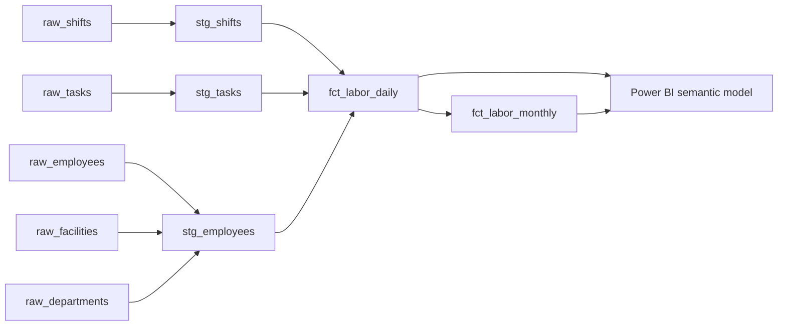

# dbt KPI Models — Healthcare Support-Services Labor Productivity

> **Representative portfolio project.** Written independently on synthetic data. It is not client code; employee IDs, facilities, and volumes are invented.

A dbt project that turns raw shift and task records into tested, documented labor-productivity tables for Power BI: tasks per worked hour, a productivity index against standard minutes, and overtime rate by facility, department, day, and month. It runs locally on DuckDB with no cloud account or credentials.

## Business problem

Operations leaders for environmental services, patient transport, and food services need to know whether staffing matches workload. When each report calculates productivity differently, and monthly figures are averaged from daily ratios, the numbers do not hold up in a budget review. This project defines each KPI once in SQL, tests it, and exposes certified tables for the semantic layer.

## Lineage



## KPI definitions

| KPI | Formula | Grain |
|---|---|---|
| Tasks per worked hour | completed tasks ÷ worked hours | facility × department × day / month |
| Productivity index | (completed tasks × standard minutes) ÷ worked minutes | facility × department × day |
| Overtime rate | overtime hours ÷ worked hours | facility × department × day / month |

Monthly ratios are recomputed from monthly sums, not averaged from daily ratios.

## Tests (25 nodes in `dbt build`)

- `unique` / `not_null` on every primary key
- `relationships` from shifts to employees and from tasks to shifts
- `accepted_values` on task status
- a custom generic test, `unique_combination_of` (in `macros/`), on the daily mart grain
- singular tests: productivity index in range, and worked hours reconcile between staging and mart

## Sample output (`fct_labor_monthly`, March 2025)

| Facility | Department | Worked hours | Tasks | Tasks / hour | Overtime rate |
|---|---|---:|---:|---:|---:|
| Riverside General | Environmental Services | 2,641.5 | 3,711 | 1.40 | 3.6% |
| Riverside General | Patient Transport | 1,772.8 | 3,186 | 1.80 | 3.6% |
| Lakeview Medical Center | Food Services | 2,467.5 | 5,922 | 2.40 | 3.8% |
| Harbor Community Hospital | Patient Transport | 2,329.2 | 4,323 | 1.86 | 3.8% |

## Quick start

```bash
git clone https://github.com/samarthass00/dbt-kpi-models-duckdb.git
cd dbt-kpi-models-duckdb
python -m venv .venv && source .venv/bin/activate
pip install -r requirements.txt
export DBT_PROFILES_DIR=.          # Windows PowerShell: $env:DBT_PROFILES_DIR="."
dbt build                          # seeds + models + tests
dbt docs generate && dbt docs serve
```

To regenerate the seed files: `python scripts/make_seeds.py`.

### Connecting Power BI

Point Power BI at the `marts` schema. For a local test, use the DuckDB ODBC driver against `workforce_kpis.duckdb`. In production the same models would run on the warehouse (Snowflake, Fabric Warehouse, or Azure SQL) by changing `profiles.yml`.

## Security

`profiles.yml` targets a local DuckDB file and holds no secrets. For a cloud warehouse, read credentials from environment variables (`{{ env_var('...') }}`) and never commit them. `*.duckdb`, `target/`, and `logs/` are git-ignored.

## Limitations and next steps

- Standard minutes are a single value per department; real engineered standards vary by task type.
- Seeds stand in for sources. Next steps are `sources:` with freshness checks, incremental models, and a dbt semantic-layer / MetricFlow definition of the three KPIs.

## License

MIT — see [LICENSE](LICENSE).
